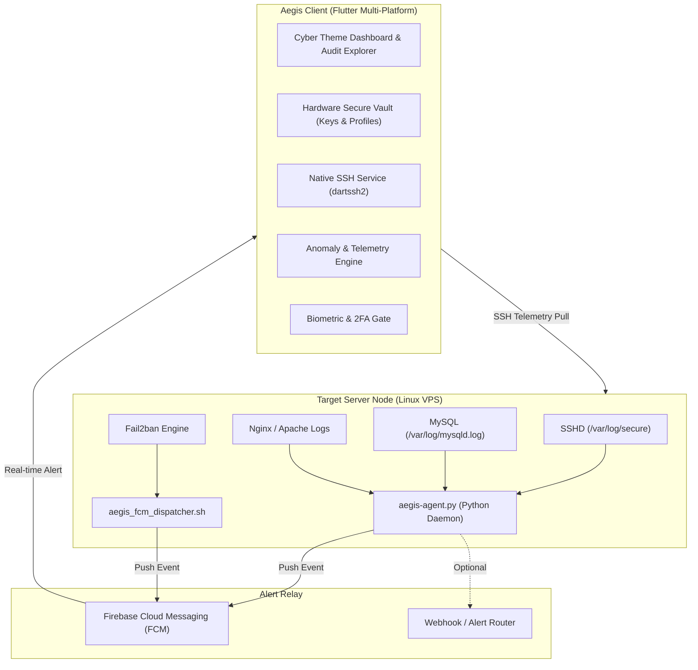

<p align="center">
  
</p>

<h1 align="center">AEGIS</h1>

<p align="center">
  <strong>Automated Enterprise Guardian for Infrastructure Systems</strong><br>
  <em>Next-Generation Zero-Trust Telemetry, Real-time Threat Intelligence & Server Hardening Client</em>
</p>

<p align="center">
  
  
  
  
  
  <a href="https://austinfascal.github.io/aegis/"></a>
</p>

---

## 🛡️ Overview

**Aegis** is an enterprise-grade security and server telemetry suite designed for systems administrators, DevOps engineers, and security teams. It bridges lightweight, server-side log watching daemons with a modern, high-performance Flutter desktop and mobile application.

Aegis monitors mission-critical services (**SSH**, **MySQL / MariaDB**, **Nginx / Web Servers**), detects anomalies and brute-force attacks in real time, executes automated penetration and compliance assessments, and dispatches instant security alerts via Firebase Cloud Messaging (FCM).

---

## ✨ Key Features

### 📡 1. Real-Time Server Telemetry & Interactive SSH Terminal
- **Direct SSH Tunneling**: Native SSH v2 client integration via `dartssh2` supporting password, passphrase-protected RSA/ED25519 keys, and auto-seeded vault profiles.
- **Hardware-Accelerated VT100 / xterm-256color Terminal**: Powered by `package:xterm` with true virtual cell buffers, reflow, and full ANSI/TrueColor rendering.
  - **Full Curses / TUI Support**: Flawlessly renders full-screen interactive programs like `htop`, `top`, `nano`, `vim`, `mc`, and `tmux` without broken escape sequences or overlapping lines.
  - **Dynamic PTY Window Resizing**: Automatically reports terminal viewport geometry (`SIGWINCH`) to remote processes on window resize or orientation change.
  - **4 Hacker & Cyber Terminal Themes**: Cyber OLED (Default neon cyan/pink), Matrix Green (phosphor CRT), Monokai Pro, and Nord Glacier.
  - **Virtual Control Key Ribbon**: Touch-friendly ergonomic keypad with `ESC`, `Ctrl+C`, `Tab`, `▲ Up`, `▼ Down`, `◀ Left`, `▶ Right`, `Home`, `End`, `PgUp`, `PgDn`, `Ctrl+D`, `Ctrl+Z`, `Ctrl+L`, `sudo`, and `| grep`.
  - **SecOps Quick-Command Toolbar**: One-tap execution of `htop`, `aegis status`, `fail2ban`, `auth log`, `uptime`, `disk (df)`, `memory (free)`, `docker ps`, `firewall (iptables)`, `netstat`, and `clear`.
  - **Responsive Mobile & Desktop Top Bar**: Compact phone layout with a consolidated **Triple-Dot Menu** (`more_vert`), eliminating top bar clutter or text overflow while preserving one-tap access to theme pickers, fullscreen mode, font zoom (A+/A-), reconnect, clear, and copy logs.
  - **Fullscreen Immersive Curses Mode**: Toggle button to maximize the terminal area to 100% viewport for distraction-free server management.
- **Hardware Telemetry**: Continuous sampling of CPU utilization, RAM consumption, disk partition metrics, server uptime, and active connection pulse.
- **Multi-Server Fleets**: Seamlessly switch between staging, production, and distributed cloud nodes (VPS, dedicated bare-metal, cloud instances).

### 📁 2. SFTP Remote File Manager & In-App Config Editor
- **Direct 1-Tap Fleet Access**: Accessible directly beside the `TERMINAL` button on every server card in the Server Fleet & Vault screen (`SFTP` button).
- **Native SFTP v3 Engine**: Built directly on `dartssh2` SFTP protocol, communicating over encrypted SSH tunnels using passwords, passphrase-protected RSA/ED25519 keys, and interactive two-factor authentication (2FA).
- **Interactive Breadcrumb Path Navigation**: Responsive path bar with clickable directory segments, root jump shortcut, and a "Jump to Path" modal with quick bookmarks (`/`, `/home/<user>`, `/etc`, `/var/log`, `/var/www`, `/tmp`).
- **Cyber File System Explorer**: Visual directory listing with file-type-specific cyber iconography (shell scripts, Python, PHP, configs, logs, compressed archives, markdown, media), Unix permission strings (`drwxr-xr-x` / `0755`), file sizes, and timestamps.
- **Dotfile Visibility Toggle**: 1-tap switch to show or hide hidden files and configuration directories (`.bashrc`, `.ssh`, `.env`, `.git`).
- **Live Search & Multi-Attribute Sort**: Instant live search filtering with case-insensitive pattern matching, plus multi-attribute ascending/descending sorting by Name, Size, Date, or Extension Type.
- **Bi-Directional File Transfer (Upload & Download)**:
  - **Upload**: Select local files and stream them directly into the remote destination directory using cross-platform file pickers.
  - **Download**: Download remote files directly to local storage or the platform Downloads folder.
- **In-App Remote Code/Text Editor**:
  - Open, review, and edit server configurations, daemon configs (`nginx.conf`, `mysqld.cnf`), shell scripts, and environment files directly within Aegis.
  - Features line numbering, monospace typography, code layout, and a 1-tap **Save** button to write modifications back over SFTP with zero latency.
- **Directory Operations**: Create new directories (`sftp.mkdir`), create blank files, rename items (`sftp.rename`), and delete files/folders with safety confirmation modals.
- **Quick Terminal Switch**: Seamless 1-tap navigation button in the top bar to jump directly into the interactive SSH terminal for the same server node.

### 🔍 3. Anomaly Detection & Forensic Audit Explorer
- **Multi-Log Surveillance**: Real-time inspection of SSH auth logs (`/var/log/secure` or `/var/log/auth.log`), database access logs (`mysqld.log`), and reverse proxy access logs.
- **Automated Threat Classification**: Instantly flags repeated brute-force attempts, unauthorized user logins, foreign or non-whitelisted IP accesses, and privilege escalation events.
- **Forensic Inspection Dialogs**: Deep-dive into individual audit events with IP geolocation metadata, threat confidence scoring, and forensic timestamps.
- **Threat Timeline Visualizations**: Interactive vector timeline charts powered by `fl_chart` tracking attack volume and severity trends over time.

### 🔐 4. Zero-Trust Hardened Client Security
- **Hardware-Backed Secure Vault**: Stores server private keys, credentials, and privilege escalation (sudo) passwords encrypted via platform keychains (Linux Secret Service, Windows Credential Manager, Android Keystore, iOS Keychain).
- **Non-Root Sudo Escalation Engine**: Allows standard non-root SSH accounts (e.g. `wito_general`, `ubuntu`, `sysadmin`) to execute kernel-level mitigations (`iptables DROP`, fail2ban bans, systemd service operations) non-interactively and securely without modifying `/etc/sudoers`.
- **Biometric & PIN Authentication**: Gated by Biometric Authentication (Fingerprint / Face ID) with an automatic 6-digit PIN fallback and lockout timer.
- **Integrated TOTP 2FA**: Built-in time-based one-time password (TOTP) verification for sensitive configuration changes and policy updates.

### ⚔️ 5. Security Policy Enforcement & Penetration Testing
- **Compliance Health Scoring**: Computes a comprehensive server security health score based on fail2ban rules, password authentication policies, and open ports.
- **Penetration Test Engine**: Runs non-destructive penetration assessments to detect open vulnerabilities and report remediation steps.
- **Policy Tuning**: Configurable threshold rules for failed login tolerances, anomaly time windows, and automated IP ban triggers.

### 🔔 6. Instant Alert Dispatcher & Live Auto-Ingestion
- **Firebase Cloud Messaging (FCM HTTP v1)**: Modern Google service-account-backed push alerts for critical security incidents and unauthorized SSH accesses.
- **Real-Time App Auto-Ingestion**: FCM notifications automatically feed directly into the live Dashboard telemetry, Audit Explorer logs, and service status monitors without requiring manual app reloads or polling.
- **Local Push Notifications**: Immediate high-priority alerts with sound and vibration channels.
- **Fail2ban Integration**: Direct hook for fail2ban ban/unban notifications to trigger real-time push alerts.

### 🌐 7. Global Threat Intelligence (AbuseIPDB Integration)
- **Live Threat Score Evaluation**: Real-time querying of the AbuseIPDB v2 database (free 1,000 checks/day) directly inside the Incident Forensics modal.
- **Community Abuse Telemetry**: Total reports, distinct reporter counts, and recent incident history across global SOCs.
- **Tor & Botnet Identification**: Automatic detection of Tor Exit Nodes, known Botnet C2 nodes, bulletproof hostings, and cloud proxies.
- **Zero-Config Fallback & Simulation**: Realistic heuristic threat profiling for simulated attacks and pen-test labs when running keyless or offline.
- **Private Subnet Recognition**: Instant RFC 1918 (10.x, 192.168.x, 172.16-31.x) and loopback filtering with zero outbound data leakage.

### 🛡️ 8. System Hardening & CIS Compliance Scanners
- **17 Baseline Security Audits**: Evaluates servers against CIS Linux Benchmarks, NIST SP 800-123 guidelines, and OpenSSH hardening standards across 5 critical domains:
  - **OpenSSH Daemon**: Root login restrictions, password authentication disabling (enforcing SSH keys), max authentication limits, and X11 forwarding lockout.
  - **Kernel & Sysctl**: Address Space Layout Randomization (ASLR), TCP SYN cookie protection against SYN floods, ICMP redirect rejection, source routing disabling, and reverse path filtering (rp_filter) anti-spoofing.
  - **Network & Firewall Exposure**: Active Fail2ban daemon verification, unencrypted legacy port closure (Telnet 23, FTP 21), and MySQL database loopback binding (127.0.0.1).
  - **Identity & Accounts**: Zero empty password hashes in `/etc/shadow` and exclusive superuser root enforcement (only 1 account with UID 0).
  - **Filesystem Integrity**: Strict file permission enforcement on `/etc/shadow` (`0000` / `0640`) and `/etc/ssh/sshd_config` (`0600`).
- **Severity-Weighted Scoring & Letter Grades**: Calculates dynamic compliance scores (`0% - 100%`) with weighted severity deductions and awards letter grades (`A+`, `A`, `B`, `C`, `F`).
- **1-Tap Automated Remediation Playbook**: Synthesizes all detected failures and warnings into a unified, executable bash script with `set -euo pipefail` to automatically patch non-compliant settings with zero manual guesswork.
- **Markdown Audit Exporter**: One-click export of structured Markdown audit reports for SOC 2, ISO 27001, and DevSecOps compliance record-keeping.
- **Universal Fleet Access**: 1-tap `HARDENING` action button directly on server cards in Server Fleet & Vault, inside Policy Settings, and through Global Settings.

---

## 🏗️ Architecture



---

## 📁 Repository Structure

```
aegis/
├── android/                 # Android native runner & build configuration
├── assets/                  # Application branding & vector assets
│   └── images/              # Aegis logo and iconography
├── lib/                     # Flutter core application logic
│   ├── core/                # Constants, themes, security vaults & utilities
│   │   ├── constants/       # AppColors, Cyber Theme tokens, service registries
│   │   ├── security/        # BiometricService, SecureVault, TotpHelper
│   │   └── utils/           # Formatters and date helpers
│   ├── models/              # Data models (ServerProfile, AuthEvent, ServerMetrics)
│   ├── providers/           # State management (ServerProvider, TelemetryProvider, etc.)
│   ├── services/            # Background services (SshService, AnomalyDetectionEngine)
│   └── ui/                  # User interface
│       ├── screens/         # Dashboard, Audit Explorer, Policy, Settings, etc.
│       └── widgets/         # Metric cards, Threat timeline, Biometric dialogs
├── linux/                   # Linux desktop native runner (GTK/CMake)
├── macos/                   # macOS native runner
├── scripts/                 # Server-side integration scripts
│   ├── aegis_fcm_dispatcher.sh   # Fail2ban to FCM push bridge
│   └── fail2ban_aegis.conf       # Fail2ban action configuration
├── server_agent/            # Python server telemetry daemon
│   ├── aegis-agent.service       # Systemd unit file
│   ├── aegis_agent.py            # Real-time log monitoring daemon
│   └── config.example.json       # Agent configuration template
├── test/                    # Unit, security, and widget test suites
├── windows/                 # Windows native desktop runner (Win32/C++)
├── pubspec.yaml             # Dart dependencies and assets declaration
└── README.md                # Project documentation
```

---

## 🚀 Getting Started

### Prerequisites

Ensure you have the following installed on your development workstation:

- **Flutter SDK**: `^3.44.0` or higher ([Install Flutter](https://docs.flutter.dev/get-started/install))
- **Dart SDK**: `^3.12.0` or higher
- **Platform-Specific Build Tools**:
  - **Linux**: `clang`, `cmake`, `ninja-build`, `pkg-config`, `libgtk-3-dev`, `liblzma-dev`
    ```bash
    sudo apt-get install -y clang cmake ninja-build pkg-config libgtk-3-dev liblzma-dev
    ```
  - **Windows**: Visual Studio 2022 with *Desktop development with C++* workload
  - **Android**: Android Studio with Android SDK Platform 34+ and Command-line Tools

### Installation

1. **Clone the repository:**
   ```bash
   git clone https://github.com/AustinFascal/aegis.git
   cd aegis
   ```

2. **Install Flutter dependencies:**
   ```bash
   flutter pub get
   ```

3. **Verify configuration:**
   ```bash
   flutter doctor
   ```

### Running the App

```bash
# Launch on Linux Desktop
flutter run -d linux

# Launch on Windows Desktop (on Windows host)
flutter run -d windows

# Launch on connected Android device or emulator
flutter run -d android
```

---

## 🛠️ Server Agent Deployment (`aegis-agent`)

The `server_agent/` directory contains a lightweight, zero-dependency Python daemon designed to run on monitored servers.

### 1. Configure the Agent
On your server (e.g., Ubuntu/Debian/CentOS VPS):

```bash
cd /opt
sudo mkdir -p aegis-agent
sudo cp /path/to/aegis/server_agent/* /opt/aegis-agent/
cd /opt/aegis-agent
sudo cp config.example.json config.json
sudo chmod 600 config.json
```

Edit `config.json` with your server parameters and notification configuration:
```json
{
  "server_id": "srv_prod_01",
  "server_name": "Production VPS",
  "mysql_log": "/var/log/mysqld.log",
  "ssh_log": "/var/log/secure",
  "access_logs_dir": "/var/log/nginx",
  "trusted_ips": ["127.0.0.1", "::1", "103.142.21.195"],
  "max_failed_attempts": 3,
  "time_window_seconds": 120,
  "service_account_file": "service_account.json",
  "fcm_topic": "aegis_alerts",
  "alert_webhook": "",
  "telegram_bot_token": "",
  "telegram_chat_id": ""
}
```

#### How to Setup FCM Push Notifications (Firebase HTTP v1 API)
Aegis Server Agent uses Google's modern **FCM HTTP v1 API** (Google officially deprecated and shut down the legacy `https://fcm.googleapis.com/fcm/send` static Server Key endpoint).

1. **Generate Service Account Key in Firebase**:
   - Open [Firebase Console](https://console.firebase.google.com/) and select your project (`aegis-project-initiative`).
   - Click the gear icon ⚙️ (**Project settings**) next to *Project Overview*.
   - Open the **Service accounts** tab.
   - Click **Generate new private key** and click **Generate key** in the confirmation modal. A `.json` file will be downloaded to your computer.
2. **Upload Key to Your Server**:
   - Upload the downloaded `.json` file to `/opt/aegis-agent/service_account.json` on your VPS.
   - Restrict file permissions for root only:
     ```bash
     sudo chmod 600 /opt/aegis-agent/service_account.json
     ```
3. **Verify Configuration**:
   - Ensure `"service_account_file": "service_account.json"` is set in `/opt/aegis-agent/config.json`.
   - The daemon automatically mints short-lived Google OAuth2 tokens using OpenSSL and securely pushes notifications to topic `/topics/aegis_alerts`.

#### Alternative Instant Alert Channels (No Firebase Required):
- **Discord Webhook**: Add your webhook URL to `"alert_webhook": "https://discord.com/api/webhooks/..."` in `config.json`. Rich embeds are formatted automatically.
- **Telegram Bot**: Fill `"telegram_bot_token": "BOT_TOKEN"` and `"telegram_chat_id": "CHAT_ID"` for immediate smartphone alerts.

### 2. Install as a Systemd Service (Auto-Start on Reboot)

`aegis-agent` includes a production systemd service definition that **automatically starts on server boot and survives restarts**:

```bash
sudo cp aegis-agent.service /etc/systemd/system/
sudo chmod 644 /etc/systemd/system/aegis-agent.service
sudo systemctl daemon-reload

# Enable auto-start on server boot and launch daemon immediately:
sudo systemctl enable --now aegis-agent.service
```

#### Why it automatically runs after server restart:
- **Boot Hook**: The service defines `WantedBy=multi-user.target`, linking it into the default multi-user runlevel.
- **Dependency Ordering**: `After=network.target mysqld.service sshd.service` ensures it only starts after networking, SSH, and database daemons are operational.
- **Self-Healing Crash Recovery**: `Restart=always` and `RestartSec=5` automatically resurrects the daemon within 5 seconds if terminated or evicted by an OOM killer.

#### Verify Service & Boot Status:
```bash
# Check runtime status
sudo systemctl status aegis-agent.service

# Confirm auto-start on reboot is enabled (output: "enabled")
sudo systemctl is-enabled aegis-agent.service

# Tail live telemetry logs
sudo journalctl -u aegis-agent -f
```

#### Uninstall / Delete the Agent Service:
If you need to stop and cleanly delete the daemon service from your server:

```bash
# 1. Stop the active service and disable auto-start
sudo systemctl stop aegis-agent.service
sudo systemctl disable aegis-agent.service

# 2. Remove the systemd service unit file and reload daemon
sudo rm -f /etc/systemd/system/aegis-agent.service
sudo systemctl daemon-reload
sudo systemctl reset-failed

# 3. (Optional) Delete the agent installation directory
sudo rm -rf /opt/aegis-agent
```

---

### 3. Do We Need a Cron Job? (Systemd vs. Cronjob)

> **Short Answer**: **NO**, a cron job is **not needed** on standard Linux servers. `systemd` is the recommended, modern Linux standard that provides continuous PID supervision, restart survival, and automatic crash recovery that cron cannot offer.

However, cron jobs can be utilized in two specific scenarios:

#### Option A: Secondary Watchdog Cron (Defense-in-Depth)
For mission-critical production environments where you want an extra safety net, add a 1-minute watchdog to root's crontab (`sudo crontab -e`):

```cron
# AEGIS Agent Watchdog: Checks every minute; starts service if stopped
* * * * * systemctl is-active --quiet aegis-agent || systemctl start aegis-agent
```

#### Option B: Non-Systemd Environments (Shared Hosting / cPanel / Legacy Containers)
If your host server does not provide `systemd` root privileges (e.g., cPanel shared hosting, OpenVZ legacy containers), configure user crontab (`crontab -e`):

```cron
# Auto-start on reboot
@reboot /usr/bin/python3 /opt/aegis-agent/aegis_agent.py >> /var/log/aegis-agent.log 2>&1 &

# 5-minute process watchdog
*/5 * * * * pgrep -f aegis_agent.py >/dev/null || (/usr/bin/python3 /opt/aegis-agent/aegis_agent.py >> /var/log/aegis-agent.log 2>&1 &)
```

---

### 4. Fail2ban Push Integration
To bridge Fail2ban ban events directly into Aegis FCM alerts:
```bash
sudo cp scripts/fail2ban_aegis.conf /etc/fail2ban/action.d/aegis.conf
sudo cp scripts/aegis_fcm_dispatcher.sh /usr/local/bin/
sudo chmod +x /usr/local/bin/aegis_fcm_dispatcher.sh
```

---

### 5. Penetration Testing vs. Fail2ban Automatic Banning

A common question is whether running a Penetration Test in Aegis automatically triggers Fail2ban to ban the test IP:

| Scenario | Does Fail2ban Auto-Ban? | Is IP Added to Ban List? | Your Real IP Safe? |
| :--- | :---: | :---: | :---: |
| **Pen-Test Simulation** | ❌ No (Safe Sandbox) | ❌ No (until 1-Tap Mitigation) | ✅ 100% Safe (Never Touched) |
| **Tapping "🛡️ Block IP"** | ✅ Yes (`fail2ban-client banip`) | ✅ Yes (SecureVault Registry) | ✅ Yes (Only Threat IP Banned) |
| **Real External Attack** | ✅ Yes (Exceeding `maxretry`) | ✅ Yes (Automated Jail Ban) | ✅ Yes |

#### How It Operates:
1. **Isolated Simulation Sandbox**: The Pen-Test Lab is designed to verify siren alerts, push notifications, and forensic investigations **without risking server downtime or flooding ports**. No hostile TCP packets hit the live daemon, so Fail2ban does not ban the IP during the test run.
2. **1-Tap Mitigation to Kernel Firewall**: When an alert fires, click **"FORENSIK" $\rightarrow$ "🛡️ BLOKIR IP"**. Aegis immediately dispatches SSH commands to enforce an active kernel ban on your server:
   ```bash
   sudo fail2ban-client set sshd banip <attacker_ip>
   sudo fail2ban-client set mysqld-auth banip <attacker_ip>
   sudo iptables -I INPUT 1 -s <attacker_ip> -j DROP
   ```
   > [!NOTE]
   > **Why `iptables -I INPUT 1 ... -j DROP` is critical**: Inserting the rule at index `1` ensures that incoming packets from the attacker are discarded immediately at the Linux Netfilter kernel layer before reaching the TCP 3-way handshake or application sockets (`sshd`, `httpd`, `mysqld`).
3. **Zero Risk of Self-Lockout**: Your workstation/phone IP is completely isolated; only the chosen threat actor IP is targeted.
4. **Real-World Attacks**: Actual unauthorized brute-force attempts from external IPs over the Internet are automatically banned by Fail2ban and relayed to Aegis via FCM alerts.

---

### 6. Non-Root SSH Users & Root Escalation (Sudo)

By default, security best practices dictate connecting to Linux servers using a non-root user (e.g. `wito_general`, `ubuntu`, `deploy`) rather than direct `root` login. However, firewall operations (`iptables`, `fail2ban-client`) and service restarts require root privileges.

Aegis supports two flexible methods to handle root privilege escalation:

#### Method A: In-App SecureVault Escalation (Recommended)
No server configuration files or `/etc/sudoers` modifications are necessary.
1. Open **Server Fleet & Vault** in Aegis.
2. Tap the **Edit / Configure** icon on your server profile.
3. Scroll to **ESKALASI ROOT (SUDO PASSWORD)**.
4. Enter your non-root user's sudo password (the one typed when running `sudo -i`).
5. Tap **Simpan & Enkripsi di Vault**.
6. The server card will display the green **`Eskalasi Sudo Siap`** badge.

When you tap **🛡️ BLOKIR IP**, Aegis securely retrieves the password from your device's hardware-backed SecureVault and executes non-interactively over the encrypted SSH channel:
```bash
echo '<sudo_password>' | sudo -S -p '' bash -c 'iptables -I INPUT 1 -s <attacker_ip> -j DROP'
```

#### Method B: Sudoers Drop-In Rule (`NOPASSWD`)
If you prefer not storing your sudo password in the client app vault, grant your user passwordless access strictly for firewall and service binaries:
```bash
# Create /etc/sudoers.d/aegis on your VPS
cat << 'EOF' | sudo tee /etc/sudoers.d/aegis
wito_general ALL=(ALL) NOPASSWD: /sbin/iptables, /usr/sbin/iptables, /usr/bin/fail2ban-client, /bin/systemctl
EOF

sudo chmod 440 /etc/sudoers.d/aegis
```

---

## 💻 Interactive SSH Terminal & SFTP Operations

Aegis equips administrators with direct remote shell and file management tools natively integrated into each server card under **Server Fleet & Vault**.

### 1. Interactive SSH Terminal
- **Access**: On any server card, tap the cyan **`TERMINAL`** button. Credentials (Password or encrypted Private Key) are securely pulled from SecureVault.
- **Curses & TUI Applications**: Full compatibility with full-screen terminal programs like `htop`, `nano`, `vim`, `mc`, and `tmux` using VT100 / xterm-256color rendering and dynamic PTY geometry reporting (`SIGWINCH`).
- **Touch-Friendly Virtual Key Ribbon**:
  - Control keys: `ESC`, `Ctrl+C`, `Tab`, `Ctrl+D`, `Ctrl+Z`, `Ctrl+L`.
  - Directional navigation: `▲ Up`, `▼ Down`, `◀ Left`, `▶ Right`, `Home`, `End`, `PgUp`, `PgDn`.
  - SecOps macros: `sudo` and `| grep` for quick command piping.
- **SecOps Quick Commands**: 1-tap toolbar executing `htop`, `aegis status`, `fail2ban`, `uptime`, `disk (df)`, `memory (free)`, `docker ps`, `firewall (iptables)`, and `netstat`.
- **Customization & Controls**:
  - 4 Cyber Themes: Cyber OLED (Neon Cyan/Pink), Matrix Green (Phosphor CRT), Monokai Pro, and Nord Glacier.
  - Fullscreen Mode: Maximize the terminal to 100% viewport.
  - Font Zoom: Increase (A+) or decrease (A-) font size on the fly.
  - Mobile Triple-Dot Menu: Consolidates controls to prevent screen overflow on smaller phone viewports.

### 2. SFTP Remote File Manager & Config Editor
- **Access**: Tap the purple **`SFTP`** button located right beside the `TERMINAL` button on any server card.
- **Directory Hierarchy & Breadcrumbs**:
  - Tap any path segment in the breadcrumb bar to jump directly to that directory level.
  - Tap the path pin icon (`edit_location_alt`) to enter absolute paths or pick Quick Bookmarks (`/`, `/home/<user>`, `/etc`, `/var/log`, `/var/www`, `/tmp`).
  - Tap `..` at the top of the list to navigate to the parent folder.
- **File System Explorer & Live Filter**:
  - Real-time search filter bar to instantly locate files by name or file extension.
  - Multi-attribute sorting (ascending/descending) by Name, Size, Modification Date, and Extension Type.
  - Dotfile switch to toggle visibility of hidden files (`.env`, `.bashrc`, `.ssh`).
- **Bi-Directional Transfer**:
  - **Upload**: Tap the floating action button or action menu to select local workstation/phone files and stream them directly over SFTP.
  - **Download**: Tap the file context menu $\rightarrow$ "Download File" to save any remote file locally or to your Downloads directory.
- **In-App Remote Text & Config Editor**:
  - View and edit daemon configuration files (`nginx.conf`, `mysqld.cnf`, `.env`, shell scripts) directly inside the app with monospace syntax and line numbering.
  - Tap **"Simpan / Save"** to stream updates back to the remote server over SFTP in real time.
- **Directory Management**: Create new folders (`sftp.mkdir`), create blank text files, rename (`sftp.rename`), delete items with confirmation dialogs, and inspect Unix permissions (`drwxr-xr-x` / `0755`) and metadata.
- **1-Tap Terminal Jump**: Tap the terminal icon in the top AppBar to switch directly into the SSH terminal session for the active server.

---

## 🛡️ System Hardening & Compliance Scanner Operations

Aegis provides a built-in CIS Benchmark and OpenSSH compliance auditing engine to assess, grade, and automatically remediate vulnerabilities across your server infrastructure.

### 1. Launching a Compliance Audit
You can access the Compliance Scanner from multiple entry points:
- **Server Fleet & Vault**: Tap the emerald **`HARDENING`** button beside `SFTP` and `TERMINAL` on any server card.
- **Policy Settings Screen**: Tap the dedicated **Compliance Scanner Card** with CIS Benchmark, OpenSSH, and NIST badges.
- **Global Settings Screen**: Open section **8. Audit Hardening & Kepatuhan CIS** to audit the active fleet node.

### 2. 17 Baseline Security Audits
Each scan evaluates 17 benchmarks across 5 foundational domains:

| Category | Benchmark Item | Standard | Expected State | Severity |
| :--- | :--- | :---: | :---: | :---: |
| **OpenSSH** | Direct Root Login Restriction | CIS 5.2.8 | `PermitRootLogin no` / `prohibit-password` | **Critical** |
| **OpenSSH** | Disable Password Authentication | CIS 5.2.11 | `PasswordAuthentication no` (Keys only) | **High** |
| **OpenSSH** | Max Authentication Attempts | CIS 5.2.7 | `MaxAuthTries <= 4` | **Medium** |
| **OpenSSH** | Disable X11 GUI Forwarding | CIS 5.2.6 | `X11Forwarding no` | **Low** |
| **Kernel / Sysctl** | Memory Randomization (ASLR) | CIS 1.5.1 | `kernel.randomize_va_space = 2` | **High** |
| **Kernel / Sysctl** | TCP SYN Cookie Protection | CIS 3.2.8 | `net.ipv4.tcp_syncookies = 1` | **High** |
| **Kernel / Sysctl** | Reject ICMP Redirects | CIS 3.2.2 | `net.ipv4.conf.all.accept_redirects = 0` | **Medium** |
| **Kernel / Sysctl** | Drop Source-Routed Packets | CIS 3.2.1 | `net.ipv4.conf.all.accept_source_route = 0` | **Medium** |
| **Kernel / Sysctl** | Reverse Path Filtering (Anti-Spoof) | CIS 3.2.7 | `net.ipv4.conf.all.rp_filter = 1` | **Medium** |
| **Firewall / Exposure** | Fail2ban Active Daemon | Aegis SecOps | Active & running systemd service | **High** |
| **Firewall / Exposure** | Telnet Port 23 Exposure | CIS 2.1.1 | Closed / Not listening | **High** |
| **Firewall / Exposure** | Legacy FTP Port 21 Exposure | CIS 2.1.2 | Closed / Not listening | **Medium** |
| **Firewall / Exposure** | MySQL Loopback Binding | Aegis DB-01 | Bound to `127.0.0.1` / `localhost` | **Medium** |
| **Identity & Access** | No Empty Shadow Password Hashes | CIS 5.4.1 | Zero accounts with empty password field | **Critical** |
| **Identity & Access** | Exclusive Root UID 0 Enforcement | CIS 5.4.3 | Exactly 1 superuser account (`root`) | **Critical** |
| **Filesystem Security** | Strict Permissions on `/etc/shadow` | CIS 6.1.3 | Permissions `0000` or `0640` | **High** |
| **Filesystem Security** | Strict Permissions on `sshd_config` | CIS 5.2.1 | Permissions `0600` | **High** |

### 3. Severity-Weighted Scoring & Letter Grades
Aegis evaluates server posture using an executive grade rating:
- **Grade A+ (95% - 100%)**: Fully hardened server meeting all CIS benchmarks and enterprise zero-trust standards.
- **Grade A (85% - 94%)**: Highly secure; only minor non-critical configuration recommendations remain.
- **Grade B (70% - 84%)**: Moderately secure; warnings or low-severity findings detected.
- **Grade C (50% - 69%)**: At risk; multiple medium or high severity non-compliant findings present.
- **Grade F (< 50%)**: Critical vulnerabilities active (e.g. root login permitted, missing ASLR, empty passwords).

### 4. 1-Tap Automated Remediation Playbook
Rather than forcing administrators to manually research fix commands, Aegis dynamically synthesizes all non-compliant findings into a consolidated, idempotent bash script:
1. Tap the code icon (`code`) in the top AppBar or tap **"Perbaiki Semua / Fix All Issues"**.
2. Review the generated playbook equipped with safety headers (`set -euo pipefail`):
   ```bash
   #!/usr/bin/env bash
   # ==============================================================================
   # AEGIS AUTOMATED HARDENING REMEDIATION PLAYBOOK
   # Generated for: Production VPS (103.142.21.195)
   # Standards: CIS Linux Benchmark & OpenSSH Hardening Guidelines
   # ==============================================================================
   set -euo pipefail

   echo "[+] Applying kernel sysctl hardening..."
   cat << 'EOF' | sudo tee /etc/sysctl.d/99-aegis-hardening.conf
   kernel.randomize_va_space = 2
   net.ipv4.tcp_syncookies = 1
   net.ipv4.conf.all.accept_redirects = 0
   net.ipv4.conf.all.accept_source_route = 0
   net.ipv4.conf.all.rp_filter = 1
   EOF
   sudo sysctl --system

   echo "[+] Hardening OpenSSH daemon..."
   cat << 'EOF' | sudo tee /etc/ssh/sshd_config.d/99-aegis.conf
   PermitRootLogin prohibit-password
   PasswordAuthentication no
   MaxAuthTries 4
   X11Forwarding no
   EOF
   sudo chmod 600 /etc/ssh/sshd_config.d/99-aegis.conf
   sudo systemctl restart sshd

   echo "[+] Securing filesystem credentials..."
   sudo chmod 0000 /etc/shadow
   sudo chmod 0600 /etc/ssh/sshd_config

   echo "✅ Aegis hardening remediation complete!"
   ```
3. Tap **"Salin Skrip / Copy Script"** and execute it directly via the Aegis SSH Terminal or server shell.
4. Tap **Rescan** (`refresh`) in Aegis to witness your server reach a **100% Grade A+** score.

### 5. Markdown Audit Export
Tap the share icon (`share`) or select **"Salin Laporan Audit"** in the options menu to export a complete, timestamped Markdown audit report to your clipboard for internal security audits, ISO 27001 compliance logs, or DevSecOps pull request reviews.

---

## 📦 Building Releases

### ⚡ Automated Cloud CI/CD Releases (GitHub Actions)

Aegis includes an automated multi-platform release pipeline defined in [`.github/workflows/release.yml`](.github/workflows/release.yml). Pushing a Git tag triggers automated compilation on cloud runners and publishes binaries directly to GitHub Releases:

```bash
# 1. Tag the release commit
git tag v1.0.0

# 2. Push the tag to trigger GitHub Actions
git push origin v1.0.0
```

- **Linux**: Automatically compiled and packaged into `aegis-linux-x64.tar.gz`
- **Android**: Automatically compiled into universal `aegis-android.apk`
- **Zero-Maintenance Landing Page**: Downloads on the [Landing Page](https://austinfascal.github.io/aegis/) link directly to the permanent GitHub CDN endpoints (`/releases/latest/download/...`), requiring zero HTML edits across future releases.

---

### 🛠️ Local Manual Builds

For offline compilation or local development testing:

#### Linux Desktop
```bash
flutter build linux --release
# Output binary bundle: build/linux/x64/release/bundle/
```
> For complete packaging, dependency details, and desktop launcher setup, see the [Linux Build & Distribution Guide](DEPLOYMENT_SETUP.md).

#### Android APK & App Bundle
```bash
# Universal Release APK (for web downloads & sideloading)
flutter build apk --release
# Output: build/app/outputs/flutter-apk/app-release.apk

# Per-ABI Split APKs (smaller downloads: arm64-v8a, armeabi-v7a, x86_64)
flutter build apk --release --split-per-abi

# App Bundle for Google Play Console
flutter build appbundle --release
# Output: build/app/outputs/bundle/release/app-release.aab
```
> For production keystore signing, Doze mode optimization, and sideloading instructions, see the [Android Build, Sign & Distribution Guide](DEPLOYMENT_SETUP_ANDROID.md).

#### Windows Desktop (via GitHub Actions)
> [!NOTE]
> Flutter Windows desktop applications cannot be cross-compiled directly from Linux hosts. Use the provided GitHub Actions workflow on a `windows-latest` runner to compile release `.exe` and `.zip` artifacts automatically.

---

### 📖 Platform Deployment & Setup Guides
- 🐧 [Linux Build & Distribution Guide](DEPLOYMENT_SETUP.md)
- 📱 [Android Build, Sign & Distribution Guide](DEPLOYMENT_SETUP_ANDROID.md)
- 🌐 [Landing Page & Download Center Setup Guide](LANDING_SETUP.md)

---

## 🧪 Testing & Code Quality

Run tests and static analysis:

```bash
# Run unit & widget tests
flutter test

# Run Dart analysis
flutter analyze
```

---

## 🔒 Security Best Practices

1. **Never commit sensitive files**:
   - `android/app/google-services.json`
   - `ios/Runner/GoogleService-Info.plist`
   - `server_agent/config.json`
   - Private SSH keys or `.keystore` files
2. **Key Storage**: All SSH private keys entered in the application are stored inside the hardware-backed secure vault and are never exported over unencrypted networks.
3. **App Lockout**: By default, Aegis locks the interface when minimized or idle, requiring biometric or PIN re-verification.

---

## 📄 License & Copyright

Copyright &copy; 2026 **CethoKaryo** (`id.cethokaryo`). All rights reserved.

This project is published under a **Proprietary Source-Available License**:
- **Source-Available**: The codebase is publicly accessible for technical review, educational evaluation, security auditing, and verification.
- **Restrictions**: Commercial deployment, distribution, sublicensing, white-labeling, or offering Aegis as a hosted service (SaaS/PaaS) without an explicit commercial license agreement from CethoKaryo is strictly prohibited.
- **Enterprise Licensing**: For commercial licensing inquiries or partnership requests, visit [cethokaryo.id](https://cethokaryo.id).

For the full legal terms and conditions, refer to the [LICENSE](LICENSE) file.
